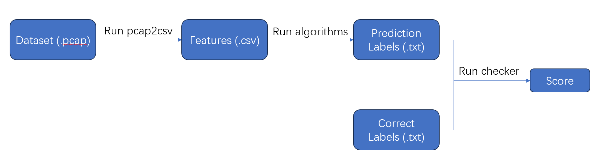

# DDoS-Detection-Challenge

This repository contains the DDoS-datasets for each stage, a reference format for the prediction labels to be submitted, judge script, and a few simple runnable sample programs.


## Preliminary Round

We provide a demo which aims at helping you to learn how to generate, submit and judge the prediction labels.



### Download Dataset

First you need to download the dataset for the current stage and put it under the corresponding subfolder. The download links for each stage dataset are shown in the corresponding subfolders.

### Generate Features

In this demo, the features of the current dataset have to be generated by:

```bash
g++ pcap2csv.cpp -o pcap2csv -O2 -lpcap
./pcap2csv {pcap file localtion} {csv file location} [label file]
```

for example:

```bash
./pcap2csv dataset/Stage0/train/SAT-01-12-2018_0 dataset/Stage0/SAT-01-12-2018_0.csv dataset/Stage0/train/train_labels.txt
./pcap2csv dataset/Stage0/SAT-03-11-2018_0.pcap dataset/Stage0/SAT-03-11-2018_0.csv
```

In Stage0, you can simply generate all the csv files by:

```bash
cd dataset/Stage0
g++ gen_all_csv.cpp -o gen_all_csv -O2
./gen_all_csv
```

The features (.csv files) will contain several column, each describes a feature. Current `pcpc2csv` will generate the following features: 

- `Flow ID, Source IP, Source Port, Destination IP, Destination Port, Protocol`: subset of the quintuple describing the identifier of the flow.
- `Total Fwd Packets,Packet Length,Total Length of Fwd Packets,Fwd Packet Length Max,Fwd Packet Length Min,Fwd Packet Length Mean,Fwd Packet Length Std`: the number of forward packets, the total/maximum/minimum/average/variance length of the forward packets in this flow.
- `Timestamp,IPD,Fwd IPD Max,Fwd IPD Min,Fwd IPD Mean,Fwd IPD Std`: the timestamp, the origin/maximum/minimum/average/variance inter-packet delay of the forward packet in this flow.
- `IP TTL,IP Diffserv,TCP Window,TCP Data Offset,Udp Len` : other features.
- `Label`: whether the flow is BENIGN or ATTACK flow. When `label file` is not provided, it will be `UNKNOWN`.

### Generate Prediction Labels

Then the prediction labels will be generated by running the provided algorithms (Random Forest or Support Vector Machine) using the features generated previously, for example, in stage0:

```bash
cd dataset/Stage0
python Stage0SimpleImplementation.py
```

The prediction labels will be stored in `dataset/Stage0/test_dataset/test_labels.txt` and should be submitted to the judge website.

### Judge script

The judge script will be logically similar to `checker.cpp`. The usage of this judge script is:

```bash
g++ checker.cpp -o checker -O2 -std=c++11
./checker [predict_labels] [correct_labels] [scorefile]
```

The `checker` will compare the two labels files and write the score  to the `[scorefile]`.


## Final Round

### Repository Code Structure

```bash
final_round/
 |_ utils/
    |_ __init__.py
    |_ utils.py
 |_ solver/
 	|_ __init__.py
    |_ solver.py: To be implemeted
 |_ main.py: the interaction library
 |_ calc_score.py: calculate score
 |_ README.md: documentation
```

### Quick start

```bash
cd final_round/
```

Download [dataset ](https://cloud.tsinghua.edu.cn/d/a46f6a3312cc43698c66/)here.

```bash
python main.py
python calc_score.py
```

### Tasks

The following two member functions of `Class Solver` in `solver/solver.py` need to be implemented:

- ``Solver.__init__()``.
  
  - Input parameters: None.
  - Return value: None.
  - Function: Initializes a `Class Solver` instance.
  
- `Solver.infer(packets, report_infer_result_func)`
  - Input parameters:
    - `packets`
    
      A list where each element is a tuple of length 2.
      The first element of the tuple is a timestamp and the second element is a packet in [python dpkt](https://dpkt.readthedocs.io/en/latest/) format.
    
    - `report_infer_result_func`
      
      A function that takes a list where each element of the list is a tuple of length 2.
      The first element of the tuple is the flow id (`srcIP-dstIP-srcPort-dstPort-protot` quintuple), and the second element is the prediction label  (`0` for the attacking flow, `1` for the background flow). This function has no return value.
    
  - Return value: None.
  
  - Function: see section *Workflow* for more details.

See the default `solver/sovler.py` in the repository for more interface details.

### Workflow

The framework will first initialize with `Solver.__init__()` and read the PCAP package into memory. The framework will then simulate replay of the PCAP package and interact with your implementation of `Solver`.

Specifically, the framework will poll the `Solver.infer()` method. Each time, the framework takes all PCAP packages since the end of the last call of `Solver.infer()` method as the `packet` argument to this call. In the `Solver.infer()` method, you can report the results of each flow through the `report_infer_result_func` method in the parameter list, which will produce results with a report timestamp. For each flow, you can determine the reporting time arbitrarily. Reporting can be done as many times as you like for each flow, but only the first report will not be ignored.

### Scoring Method

The above process actually simulates a simplified serial detection scenario. When a flow is judged to be an attack flow, the device will not allow the flow to continue to pass; on the contrary, it will be recognized as a benign flow and will not be intercepted subsequently. Therefore, the earlier a correct judgment is made, the higher the score should be. Wrong judgments should not be scored, since judging an attack flow as a benign flow will result in missing all attacks, while judging a benign flow as an attack flow will result in a disruption of the benign flow, the latter of which is usually unacceptable in real scenarios - even if the first few packets pass through normally, this may result in, e.g., an unexpected connection abort as well.

Therefore, we simplify the real problem and design to obtain the following scoring method:

1. for each flow, no report or incorrectly prediction will result in a score of 0 for that flow (i.e., all packets in that flow will be considered misclassified).
2. otherwise, if the total length of the flow is $n$ and the first result are reported correctly during the $k$-th package and the $k+1$-th package, then this flow will receive an $n-k$ score.
3. However, for flow of length $1$, the above scoring method will always result in a score of $0$, so we allow for some degree of delay. That is, let the $k$-th packet's timestamp be $t_k$ and the inference time be $t_k\le t<t_{k+1}$. If $t\le t_k+t'$, then the $k$-th packet will be considered as the correct classified and thus the flow gets $n-k+1$ points, where $t'$ is our available inference delay, and the value of which is affected by the performance of the test environment.
4. Finally it's scored using the `F1-score` when some packets of each flow are classified correctly (a suffix which may be null or the whole flow of each flow will be classified correctly). 

### Submit and Judge Online

Submit a compressed package in `.zip` format, which when unzipped will replace the contents of the `solver/` directory and add the training dataset `train.pcap` with `train_labels.txt` to it, which will then be tested in a similar way to the local.

**Please note that the following behaviors will be considered cheating and may result in disqualification in severe cases**:

- Trying to connect to the network
- Attempting to gain administrator privileges
- Reading or writing files other than the `solver/` directory, such as test dataset, test labels, other framework code, etc.
- Malicious attacks on the judge server

**In addition to the above, the following may result in a score of 0 for this submission:**

- Program runtime errors
- `main.py` ran longer than the time limit
- A non-existent flow was reported
- `report_infer_result_func` parameter is out of format
- No background flow were classified correctly
- The submitted file did not meet the requirements, e.g., it was not a `*.zip` file or could not be unzipped properly, no `solver.py`, or no format-compliant interface was provided.
- The environment is misconfigured

### Online Submission Restrictions

1. Length of the submitted code: the size of the submitted `.zip` file must not exceed 100MB.

2. Memory: 8 GiB.

3. Runtime: `main.py` must not run for more than 10 minutes. 

4. Number of submissions: due to resource and evaluation time constraints, only one submission in 15min is allowed.

5. Test environment:

   - Ubuntu 22.04

   - Python 3.12.3
   - **NO GPU PROVIDED.**


### Online Environment Configuration

A `docker` will be provided for each team, and a list of installed `python` libraries will be uploaded later.

There are two ways to configure the online environment:

- For a small number of installations, the libraries to be installed can be exported and compressed together into a commit file using offline installation and installed at `solver.__init__()`. This solution may face problems with the size limit of the commit file and the time limit, and the installation process cannot request administrator privileges.
- In general, it is recommended that an explicit installation method or installation script be sent to `thu.aitrans2024@gmail.com`, which will then be configured manually. Due to manpower constraints, it is expected that the configuration of the environment will be handled centrally every 24h.

In order to avoid frequent environment configurations and other problems early in the final round, the online submission channel is not expected to be open for at least a week. Please explore relatively stable environment dependencies locally and submit environment configuration instructions or scripts once the online submission channel is open.
