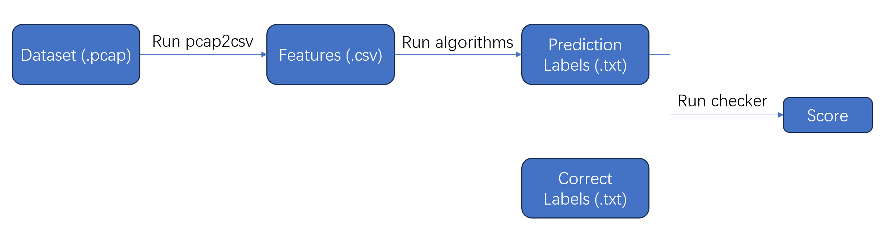

# DDoS-Detection-Challenge

This repository contains the DDoS-datasets for each stage, a reference format for the prediction labels to be submitted, judge script, and a few simple runnable sample programs.


## Quick Start & Usage of this repository

We provide a demo which aims at helping you to learn how to generate, submit and judge the prediction labels.



### Download Dataset

First you need to download the dataset for the current stage and put it under the corresponding subfolder. The download links for each stage dataset are shown in the corresponding subfolders.

### Generate Features

In this demo, the features of the current dataset have to be generated by:

```bash
g++ pcap2csv.cpp -o pcap2csv -O2 -lpcap
./pcap2csv [pcap file localtion] [csv file location]
```

for example:

```bash
./pcap2csv dataset/Stage0/train.pcap dataset/Stage0/train.csv
./pcap2csv dataset/Stage0/test.pcap dataset/Stage0/test.csv
```

The features (.csv files) will contain several column, each describes a feature. Current `pcpc2csv` will generate the following features: 

- `flow_id`: subset of the quintuple describing the identifier of the flow.
- `ip_src, ip_dst, port_src, port_dst, protocol`: the quintuple including source/destination ip/port and protocol.
- `total_pkt_size, avg_pkt_size_avg, max_pkt_size, min_pkt_size, var_pkt_size`: the total/average/maximum/minimum/variance size of each flow.
- `ipd, min_ipd, avg_ipd, var_ipd`: the origin/minimum/average/variance of inter-packet delay.
- `ip_ttl ,ip_diffserv, tcp_window, tcp_data_offset...` : other features.

### Generate Prediction Labels

Then the prediction labels will be generated by running the provided algorithms (Random Forest or Support Vector Machine) using the features generated previously, for example:

```bash
python SupportVectorMachine.py \
	--train_dataset=dataset/Stage0/train.csv\
	--train_labels=dataset/Stage0/train_labels.txt\
	--test_dataset=dataset/Stage0/test.csv\
	--test_labels=dataset/Stage0/test_labels.txt
```

The prediction labels will be stored in `dataset/Stage0/test_labels.txt` and should be submitted to the judge website.

### Judge script

The judge script will be logically similar to `checker.cpp`. The usage of this judge script is:

```bash
g++ checker.cpp -o checker -O2
./checker [labels1] [labels2] [scorefile]
```

The `checker` will compare the two labels files and write the score  to the `[scorefile]`.
